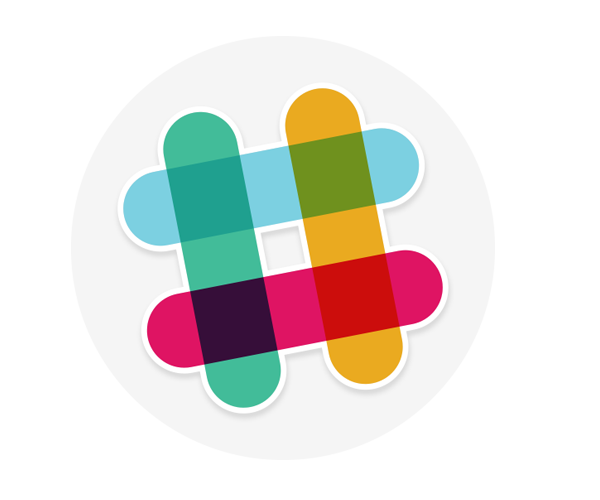

# Slack Pull Request Reminder




## Description
An automatic reminder scheduler for Slack. Sends reminder Slack messages under your user name every hour to remind teammates to check out your github pull request.

## Dependencies
- nodejs (v6.11.3LTS or higher) <a href='https://nodejs.org'>https://nodejs.org</a>
- Slack <a href='https://slack.com/downloads'>https://slack.com/downloads</a>

## Running the App: 
### Step 1 Install Dependencies
- run `npm i` to install dependencies

### Step 2 Setup your github and slack in config.js
- Get a slack API token from your group's slack here: https://api.slack.com/custom-integrations/legacy-tokens. You will need to be signed into slack to generate a token.
- paste that token into `config.js`:
- enter in all your github info too
```
// config.js
module.exports = {
    // enter github username and password
    github: {
        credentials: {
            type: "basic",
            username: GITHUB_USERNAME,
            password: GITHUB_PASSWORD
        },
        repo: {
            owner: OWNER,
            repo: REPO
        }
    },
    // create token at https://api.slack.com/custom-integrations/legacy-tokens
    slack: SLACK_API_TOKEN
}
```

### Step 3 Run the app
- to run the app, execute the following in your terminal with your desired recipient's slack username and a link to your PR:
```
user=bob pr=http://github.com/example-pr/12345 node remind.js 
```
- to send to multiple users at once:
```
user=bob,sally,jamie pr=http://github.com/example-pr/12345 node remind.js 
```
### Step 4
- keep the app running in a terminal tab for as long as you want to keep reminding people. the app will remind people up to 5 times per time you run it
- to stop reminding people, press `Ctrl + C` to quit the app.
## Notes
example of how to tag someone on slack: 
```
'Hey <@U024BE7LH|bob>, did you see my PR?'
```
- remember to use the @ + userID + | + human readable name
